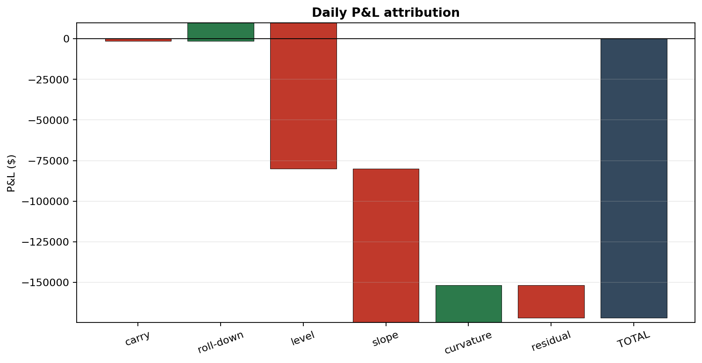
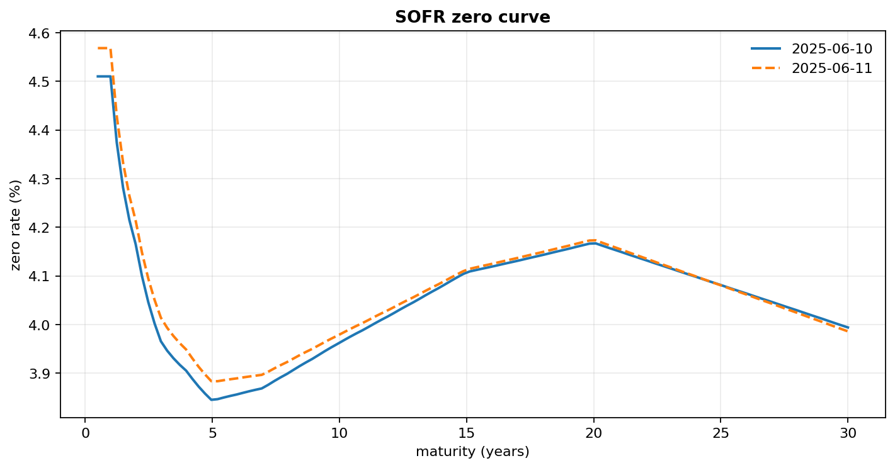

# SOFR Swap Valuation & P&L Attribution

Bootstrap a SOFR curve, mark a book of vanilla interest-rate swaps, and decompose
the daily P&L into the buckets a rates desk actually reports — **carry, roll-down,
and curve moves (level / slope / curvature)** — with the parts summing exactly to
the total.



## What it does

1. **Bootstrap** a single SOFR discount curve from par swap rates (`curve.py`).
2. **Price** fixed-vs-SOFR swaps off that curve — NPV, par rate, DV01 (`pricing.py`).
3. **Attribute** the change in mark-to-market between two days into carry,
   roll-down, and the curve move, split by shape (`attribution.py`).

On the bundled two-day example (a ~5bp sell-off that flattens the curve), a 10-swap
book moves like this:

| Bucket | P&L ($) | What it is |
|---|--:|---|
| Carry | −1,310 | net coupon (float − fixed) earned over the day |
| Roll-down | +11,083 | sliding along a static curve as maturities shorten |
| Level | −89,818 | parallel rate move |
| Slope | −94,549 | steepening/flattening |
| Curvature | +23,015 | belly vs. wings |
| Residual | −20,262 | convexity + off-shape moves |
| **Total** | **−171,840** | reconciles to full revaluation (check ≈ 1e-10) |



## Method

**Curve.** Par rates are interpolated to an annual grid and bootstrapped by forward
substitution, `DF_k = (1 − S_k·A_{k-1}) / (1 + S_k·τ)`. Discount factors interpolate
log-linearly (piecewise-flat forwards). Every input par swap reprices to zero — the
test suite asserts it.

**Pricing.** A payer swap is valued by the bond-minus-floater identity,
`NPV = N·[(1 − DF(T)) − K·Σ τ_i DF(t_i)]`, with the float leg taken at par on the
reset (exact on reset dates; a small, consistent approximation between them).

**Attribution.** The total is built to be *exactly additive*:

- Roll the **same** curve forward one day → time effect, split into **carry**
  (net coupon accrued) and **roll-down** (the rest).
- Re-price with the **new** curve → the rate move. Linearise it with the portfolio's
  key-rate durations, project the pillar-rate change onto **level / slope /
  curvature** basis shapes, and book the convexity and basis misfit as **residual**.

## Project structure

```
sofr-swap-pnl-attribution/
├── src/sofr_swap/
│   ├── conventions.py   # day count, schedules
│   ├── curve.py         # bootstrap, discount/forward, curve shifts
│   ├── instruments.py   # Swap
│   ├── pricing.py       # NPV, par rate, DV01
│   ├── attribution.py   # carry / roll-down / level-slope-curvature
│   └── viz.py           # curve + waterfall plots
├── scripts/run_attribution.py
├── data/                # sample par-swap quotes + a 10-swap book
├── tests/test_pricing.py
└── results/             # generated marks, attribution, charts
```

## Run

```bash
uv sync
uv run python scripts/run_attribution.py   # -> results/
uv run pytest                              # par-swap, DV01, additivity checks
```

## Notes & assumptions

- **Single curve.** SOFR projects and discounts — standard for a collateralised USD
  book; a dual-curve (OIS-discounted, separate projection) setup would slot into the
  same pricer.
- **Synthetic data.** The bundled quotes and book are realistic but illustrative, so
  the project runs with no market-data feed. The methodology is what's on display.
- **Valued at reset.** The float leg is taken at par on reset dates; intra-period
  stubs are ignored, which is immaterial for a daily P&L and stated for honesty.

---

*Built by Tejas Pandya — NYU MSFE.*
