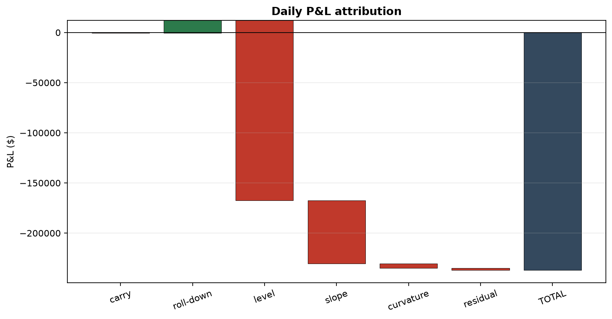
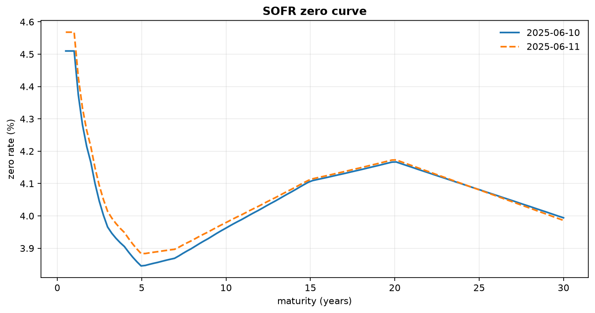
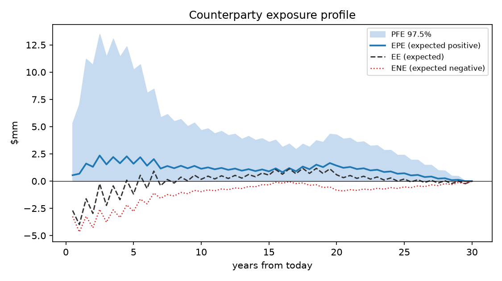
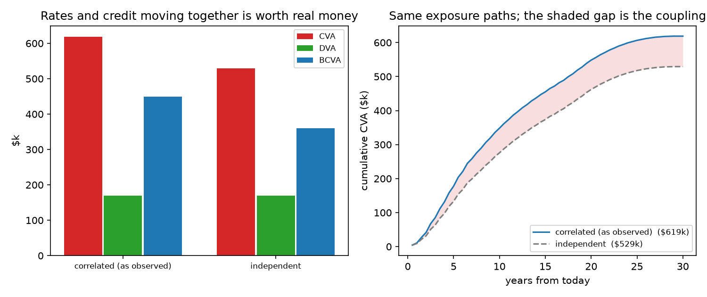

# SOFR Swap Valuation & P&L Attribution

Bootstrap a SOFR curve, mark a book of vanilla interest-rate swaps, and decompose
the daily P&L into the buckets a rates desk actually reports — **carry, roll-down,
and curve moves (level / slope / curvature)** — with the parts summing exactly to
the total.



## What it does

1. **Bootstrap** a single SOFR discount curve from par swap rates (`curve.py`).
2. **Price** fixed-vs-SOFR swaps off that curve — NPV, par rate, DV01 (`pricing.py`).
3. **Attribute** the change in mark-to-market between two days into carry,
   roll-down, and the curve move, split by shape (`attribution.py`).

Curves come from FRED — Treasury constant-maturity par yields, real and keyless, daily
back to the 1960s. The book is hypothetical (ten swaps, net receiver $91mm) because no
dealer publishes its positions; the market data is not.

31 August to 1 September 2026, a 2–6bp sell-off that steepened the front end:

| Bucket | P&L ($) | What it is |
|---|--:|---|
| Carry | −353 | net coupon (float − fixed) earned over the day |
| Roll-down | +12,336 | sliding along a static curve as maturities shorten |
| Level | −179,601 | parallel rate move |
| Slope | −62,753 | steepening/flattening |
| Curvature | −4,558 | belly vs. wings |
| Residual | −2,176 | convexity + off-shape moves |
| **Total** | **−237,106** | reconciles to full revaluation (check = 0.00e+00) |

The residual is 0.9% of the total on a small move. Ask for the largest one-day move in
the ten-year that the sample contains and it becomes 9%:

```
uv run python scripts/run_attribution.py --worst-day
curve move (bp): 1y -76  2y -75  3y -74  5y -59  7y -57  10y -67  20y -51  30y -56
```

16 April 1980 — the week the Fed's credit controls broke the market. The whole curve
fell 51 to 76 basis points in a day, the book made $1,842,480, and $169,372 of it is
convexity that a first-order attribution cannot name. That is the honest limit of a
DV01-based decomposition, and it only shows up if you point it at a real crisis.



## Method

**Curve.** Par rates are interpolated to an annual grid and bootstrapped by forward
substitution, `DF_k = (1 − S_k·A_{k-1}) / (1 + S_k·τ)`. Discount factors interpolate
log-linearly (piecewise-flat forwards). Every input par swap reprices to zero — the
test suite asserts it.

**Pricing.** A payer swap is valued by the bond-minus-floater identity,
`NPV = N·[(1 − DF(T)) − K·Σ τ_i DF(t_i)]`, with the float leg taken at par on the
reset (exact on reset dates; a small, consistent approximation between them).

**Attribution.** The total is built to be *exactly additive*:

- Roll the **same** curve forward one day → time effect, split into **carry**
  (net coupon accrued) and **roll-down** (the rest).
- Re-price with the **new** curve → the rate move. Linearise it with the portfolio's
  key-rate durations, project the pillar-rate change onto **level / slope /
  curvature** basis shapes, and book the convexity and basis misfit as **residual**.

## The math

**Bootstrap.** A par swap of maturity $t_k$ with fixed rate $S_k$ satisfies
$S_k \sum_{i=1}^{k} \tau_i \, DF_i = 1 - DF_k$. Writing the annuity accumulated so
far as $A_{k-1} = \sum_{i<k} \tau_i DF_i$ and solving for the unknown discount factor:

$$DF_k = \frac{1 - S_k \, A_{k-1}}{1 + S_k \, \tau_k}$$

Forward substitution from the shortest pillar gives the whole curve; log-linear
interpolation of $DF$ between pillars is equivalent to piecewise-flat instantaneous
forwards.

**Pricing.** The bond-minus-floater identity for a payer swap with notional $N$ and
fixed rate $K$:

$$V = N\left[\big(1 - DF(T)\big) - K \sum_i \tau_i \, DF(t_i)\right]$$

The float leg collapses to $1 - DF(T)$ because a par floater marks at par on reset.
DV01 is the bump-and-reprice derivative $\partial V / \partial y \cdot 1\text{bp}$.

**Attribution.** Between days the change splits as

$$\Delta V = \underbrace{\Delta V_{\text{time}}}_{\text{carry + roll-down}} + \underbrace{\sum_k \text{KRD}_k \, \Delta z_k}_{\text{linear rate move}} + \text{residual}$$

where $\text{KRD}_k = \partial V / \partial z_k$ are key-rate durations (bump one
pillar's zero rate, hold the rest). The pillar move $\Delta z$ is projected onto
orthogonal level / slope / curvature shapes, so the buckets are additive by
construction and the residual isolates convexity plus off-shape moves. The test
suite asserts the sum reconciles to full revaluation at ~1e-10.

## References

- Hagan, P. & West, G. (2006), *Interpolation Methods for Curve Construction*, Applied Mathematical Finance 13(2).
- Tuckman, B. & Serrat, A., *Fixed Income Securities* (3rd ed.) — key-rate durations, ch. 5.
- Andersen, L. & Piterbarg, V. (2010), *Interest Rate Modeling*, Vol. I — curve building and swap mechanics.
- Gregory, J. (2020), *The xVA Challenge* (4th ed.) — exposure profiles, CVA/DVA, wrong-way risk.
- Brigo, D. & Capponi, A. (2010), *Bilateral Counterparty Risk with Application to CDSs*, Risk.
- Litterman, R. & Scheinkman, J. (1991), *Common Factors Affecting Bond Returns*, Journal of Fixed Income — the three factors.
- Politis, D. & Romano, J. (1994), *The Stationary Bootstrap*, JASA — why blocks, not days.

## What the book costs in credit (`cva.py`)

A swap's mark-to-market is symmetric; its credit risk is not. If the counterparty
defaults while the book is worth +$4mm to us we recover a fraction; if it is worth
−$4mm we still owe it in full. CVA prices that asymmetry:

`CVA = (1 − R) · Σ_k DF(t_k) · EPE(t_k) · [S(t_{k−1}) − S(t_k)]`

Exposure is simulated by **block-bootstrapping real daily curve moves** — every path is
a sequence of days that actually happened, in ten-day blocks, so a fortnight of 2008
arrives intact rather than as twenty independent draws from a fitted normal. The
counterparty's spread is resampled from the *same* days, which carries the real
relationship between rates and credit into the simulation without anyone choosing a
correlation.

```bash
uv run python scripts/run_cva.py                      # BAA counterparty, 20k paths
uv run python scripts/run_cva.py --quality AAA
```

**8,478 joint daily observations, 1986-01-02 to 2026-09-01.** Credit comes from
Moody's BAA10Y and AAA10Y rather than the ICE BofA OAS series, for the unglamorous
reason that FRED's public CSV truncates ICE BofA to three years whatever `cosd` you
pass — and three years of credit history contains no crisis. Moody's comes back whole:
1998, 2008, 2011 and 2020 are all in it, and the BBB spread peaks at 616bp on
2008-12-04.



Peak EPE $2.35mm at 2.5 years, peak PFE(97.5%) $13.5mm at the same point. The sawtooth
is not noise — it is the annual coupon. Exposure builds through an accrual period and
drops the day the coupon is paid, and a profile that came out smooth would mean the
simulation had lost the schedule.

### Wrong-way risk, measured rather than assumed

The book is net receiver $91mm, so it gains when rates fall. In the data,
**corr(Δ10y, Δ BBB spread) = −0.38**: rates fall when credit widens. Those two facts
together mean the book is worth most exactly when the counterparty is least able to
pay. Run it again with the spread resampled from *different* days — same marginal
distribution, coupling destroyed — and the difference is the price of that:

| BAA counterparty, 20,000 paths | CVA | DVA | BCVA |
|---|--:|--:|--:|
| correlated, as observed | **$618,890** | $169,322 | $449,567 |
| independent | $529,337 | $169,322 | $360,015 |
| **wrong-way risk** | **+$89,553** | — | **+16.9%** |



The two runs share their curve paths bit-for-bit — the same generator draws the same
days, and only the spread's index changes — so the $89,553 is the coupling and not
Monte Carlo noise. DVA coming out equal to the dollar in both rows is the proof, and a
test asserts it.

Move to an AAA counterparty and CVA falls to $601,812 while wrong-way risk *rises* to
+21.5%. A better counterparty is not a safer one in the same proportion: AAA10Y is more
strongly anti-correlated with Treasury yields (−0.47 against BBB's −0.38), because
flight-to-quality is exactly the trade that compresses the highest-grade spread against
governments.

### Why the curves are constrained

Simulating each pillar as its own random walk breaks the bootstrap. Nothing stops the
one-year from wandering to its floor while the thirty-year sits at nine percent, and
that curve has no positive discount factor at the long end: the par rate times the
annuity exceeds one and `DF_k` comes out negative. It is not a numerical accident — the
curve does not exist. Every one of the 8,478 real curves in the sample bootstraps to
strictly positive discount factors; the simulated ones did not.

Three fixes, in order of how much they do:

1. **Simulate in PCA factor space.** Three principal components of the real daily
   changes carry **98.0%** of the variance (87.4 / 8.6 / 2.0) and come out as the
   textbook three — a flat level, a monotone slope, a hump. Every simulated move is
   then a combination of shapes the curve actually makes.
2. **Clip to the observed envelope.** Each pillar to its own historical high and low,
   and the 2s30s and 1s5s slopes to theirs. An unconstrained thirty-year walk produces
   2s30s of 740bp against a historical maximum of 401.
3. **Repair what is left.** Under a tenth of a percent of curves still land somewhere
   unpriceable; those are shrunk toward today's curve until they are priceable, and the
   simulation reports the share. Dropping them instead would quietly delete the most
   extreme scenarios from a distribution whose entire purpose is the tail.

### Where this is soft

This is a **historical** CVA — the measure a risk department uses for EPE and PFE
limits. A CVA desk marking a reserve wants risk-neutral exposure calibrated to swaption
volatility, which is a different number and needs data that is not free. Recovery is
40%, ISDA's standard senior-unsecured assumption, and the script takes `--recovery` so
you can see what it is worth. There is no collateral agreement modelled: a CSA with
daily margin would cut this exposure to a margin-period-of-risk gap, and its absence is
the single largest thing standing between these numbers and a real counterparty.

## Project structure

```
sofr-swap-pnl-attribution/
├── src/sofr_swap/
│   ├── conventions.py   # day count, schedules
│   ├── curve.py         # bootstrap, discount/forward, curve shifts
│   ├── instruments.py   # Swap
│   ├── pricing.py       # NPV, par rate, DV01
│   ├── attribution.py   # carry / roll-down / level-slope-curvature
│   ├── market.py        # FRED loaders: CMT pillars, Moody's credit spreads
│   ├── cva.py           # exposure simulation, EPE/PFE, CVA / DVA / BCVA
│   └── viz.py           # curve, waterfall, exposure profile, wrong-way charts
├── scripts/
│   ├── run_attribution.py   # daily P&L decomposition
│   └── run_cva.py           # exposure profile and the wrong-way experiment
├── data/
│   ├── fred/            # cached FRED series (real market data)
│   └── positions.csv    # the hypothetical 10-swap book
├── tests/test_pricing.py    # 18 checks
└── results/, reports/   # generated marks, attribution, exposure, charts
```

## Run

```bash
uv sync
uv run python scripts/run_attribution.py             # -> results/
uv run python scripts/run_attribution.py --worst-day # the biggest 10y move on record
uv run python scripts/run_cva.py                     # -> reports/
uv run pytest                                        # 18 checks
```

## Notes & assumptions

- **Single curve.** SOFR projects and discounts — standard for a collateralised USD
  book; a dual-curve (OIS-discounted, separate projection) setup would slot into the
  same pricer.
- **Treasury, not swap, curve.** The discount curve is bootstrapped from Treasury CMT
  par yields. A collateralised SOFR book discounts on the SOFR curve, which sits a swap
  spread away. ICE Swap Rate is licensed and FRED's public endpoint caps ICE BofA series
  at three years, so the choice is a real Treasury curve or a made-up SOFR one. The
  pricer does not care which par rates it is handed; `curve.py` takes tenors and rates.
- **The book is hypothetical.** Ten swaps, net receiver $91mm. Nobody publishes a real
  dealer's positions. Every price the book is marked against is real.
- **Valued at reset.** The float leg is taken at par on reset dates; intra-period
  stubs are ignored, which is immaterial for a daily P&L and stated for honesty.

---

*Built by Tejas Pandya — NYU MSFE.*
